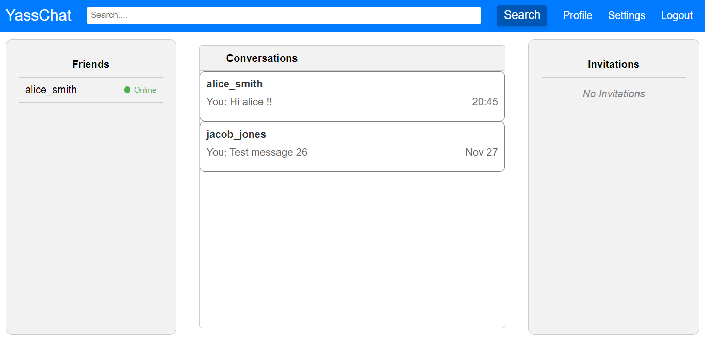

# YassChat - ALX Foundations Portfolio Project

YassChat is a real-time chat application developed as part of the ALX Foundations curriculum. This project showcases fundamental skills in web development, Flask, Socket.IO, and more.

## Features

- Real-time chat between users
- User authentication and session management
- Friendship invitations and acceptance
- Integration of Flask, Socket.IO, and MySQL database

## Technologies Used

- Flask: A lightweight web application framework in Python
- Socket.IO: Real-time web application framework
- MySQL: Database for storing user information and chat messages
- HTML/CSS: Frontend design and styling
- JavaScript: Client-side scripting for dynamic functionality
- CORS: Cross-Origin Resource Sharing for handling requests from different origins

## How to Run

1. Clone the repository: `git clone https://github.com/yassirbrh/yasschat-alx-foundations-portfolio-project.git`
2. Set up your MySQL database and update configuration in `config.py`
3. Run the application: `sudo python3 app.py`
4. Access the application in your web browser: `http://localhost:5000`

## Project Structure

- `/templates`: HTML templates for different views
- `/static`: Static files (CSS, JavaScript, images)
- `/app.py`: Main application file
- `/config.py`: Configuration settings
- `/app/models`: Database models for User, Message, Friendship.
- `/app/api`: Flask routes for handling API Requests.
- `/app/routes.py`: Flask routes for handling HTTP requests
- `/app/sockets.py`: Socket.IO events and handlers
- `db_yasschat.sql`: SQL script to create the database YassChat and the tables (User, Friendship, Message)
- `create_fake_user_data.sql`: SQL script to create fake user data in the database.

## Contributions

Contributions are welcome! If you find any issues or have suggestions for improvements, feel free to open an issue or submit a pull request.

